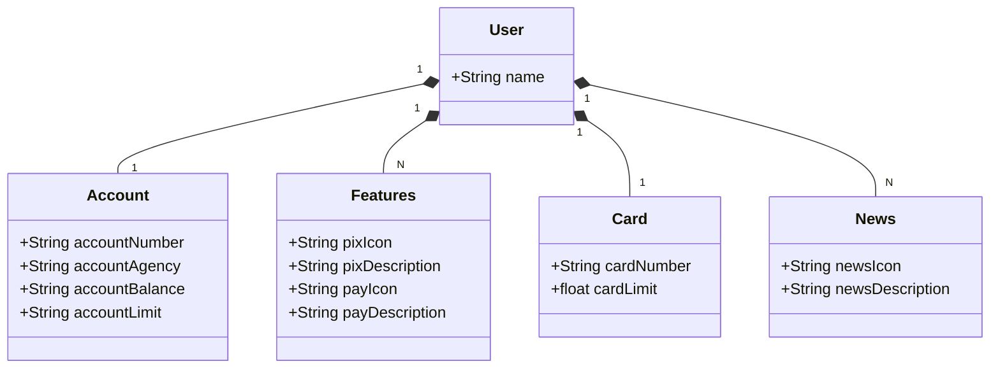

# Santander Dev Week 2024

Java RESTful API criada para a Santander Dev Week.

## Principais Tecnologias
 - **Java 17**: Utilizaremos a versão LTS mais recente do Java para tirar vantagem das últimas inovações que essa linguagem robusta e amplamente utilizada oferece;
 - **Spring Boot 3**: Trabalharemos com a mais nova versão do Spring Boot, que maximiza a produtividade do desenvolvedor por meio de sua poderosa premissa de autoconfiguração;
 - **Spring Data JPA**: Exploraremos como essa ferramenta pode simplificar nossa camada de acesso aos dados, facilitando a integração com bancos de dados SQL;
 - **OpenAPI (Swagger)**: Vamos criar uma documentação de API eficaz e fácil de entender usando a OpenAPI (Swagger), perfeitamente alinhada com a alta produtividade que o Spring Boot oferece;
 - **Railway**: facilita o deploy e monitoramento de nossas soluções na nuvem, além de oferecer diversos bancos de dados como serviço e pipelines de CI/CD.

## IMPORTANTE
Este projeto foi construído com um viés de prática de estudo relaciona ao Bootcamp Santander Dev week Java Backend 2024 oferecido pela Digital Inovation One (DIO).

## Diagrama de Classes

## Executando a API em banco de dados local Postgres

Fiz diversas tentativas e pesquisas mas não consegui fazer a execução na nuvem. Consequentemente apenas consegui fazer o projeto funcionar localmente, sem mais acréscimos.
